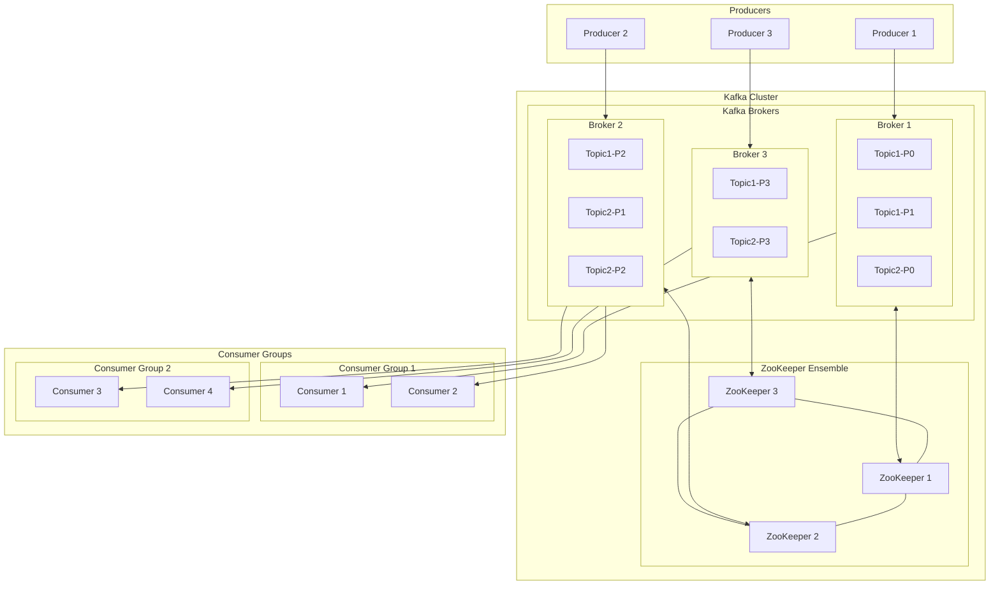

# Kafka Architecture

```mermaid

flowchart TB
    subgraph Producers["Producers"]
        P1[Producer 1]
        P2[Producer 2]
        P3[Producer 3]
    end

    subgraph KafkaCluster["Kafka Cluster"]
        subgraph ZK["ZooKeeper Ensemble"]
            Z1[ZooKeeper 1]
            Z2[ZooKeeper 2]
            Z3[ZooKeeper 3]
        end

        subgraph Brokers["Kafka Brokers"]
            subgraph B1["Broker 1"]
                T1P0[Topic1-P0]
                T1P1[Topic1-P1]
                T2P0[Topic2-P0]
            end

            subgraph B2["Broker 2"]
                T1P2[Topic1-P2]
                T2P1[Topic2-P1]
                T2P2[Topic2-P2]
            end

            subgraph B3["Broker 3"]
                T1P3[Topic1-P3]
                T2P3[Topic2-P3]
            end
        end
    end

    subgraph Consumers["Consumer Groups"]
        subgraph CG1["Consumer Group 1"]
            C1[Consumer 1]
            C2[Consumer 2]
        end

        subgraph CG2["Consumer Group 2"]
            C3[Consumer 3]
            C4[Consumer 4]
        end
    end

    P1 --> B1
    P2 --> B2
    P3 --> B3

    Z1 --- Z2
    Z2 --- Z3
    Z3 --- Z1

    B1 <--> Z1
    B2 <--> Z2
    B3 <--> Z3

    B1 --> C1
    B2 --> C2
    B2 --> C3
    B3 --> C4
```